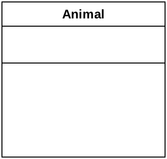
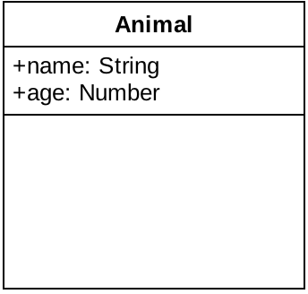
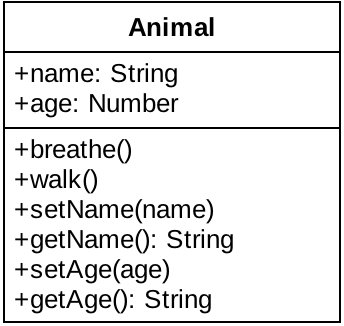
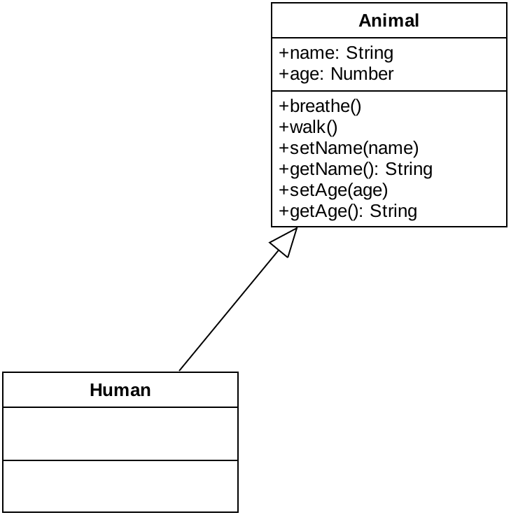
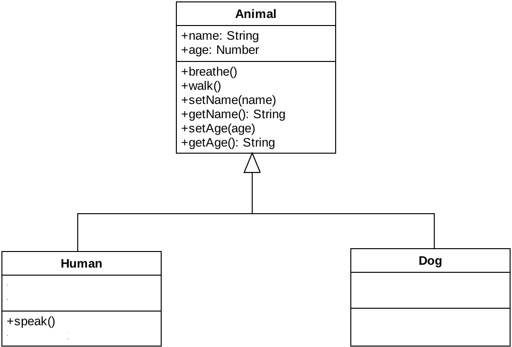
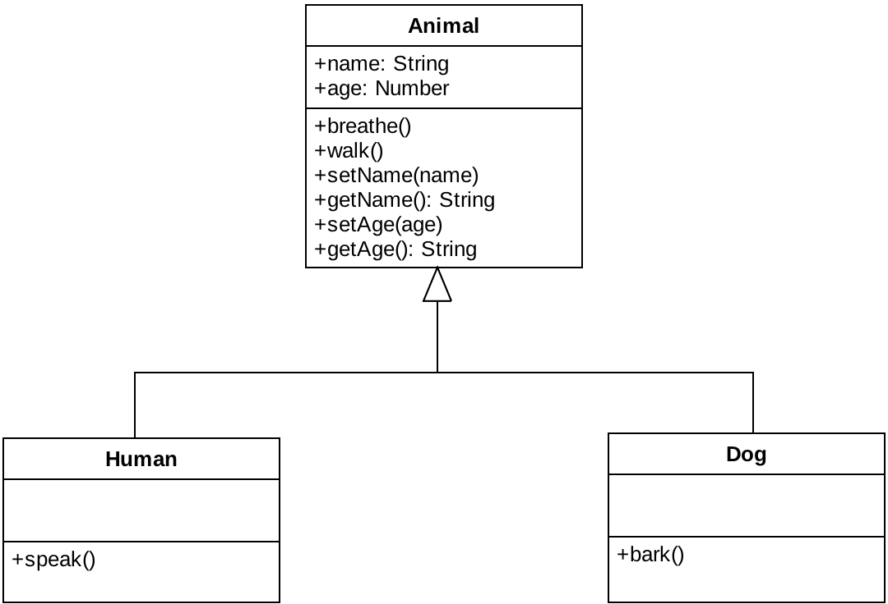
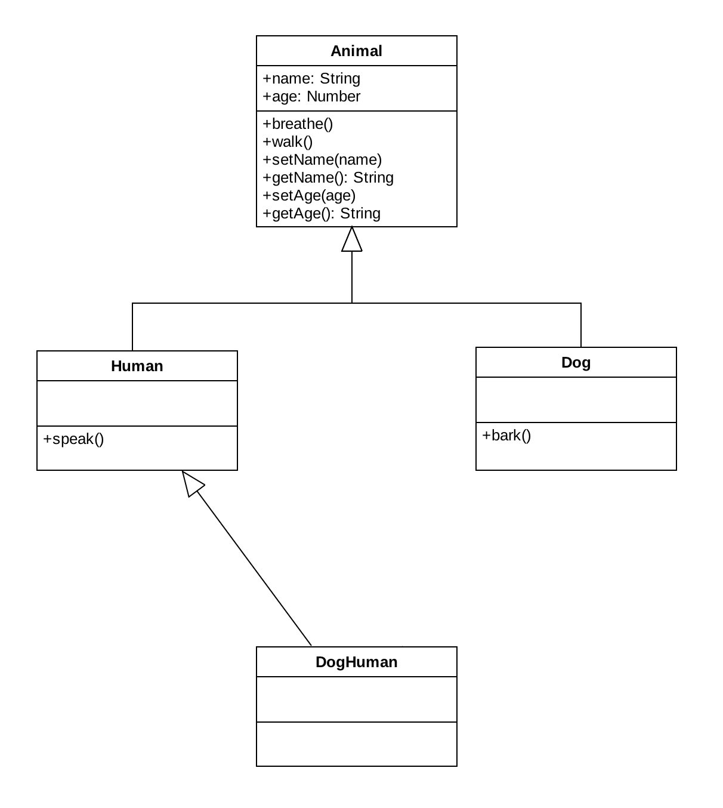
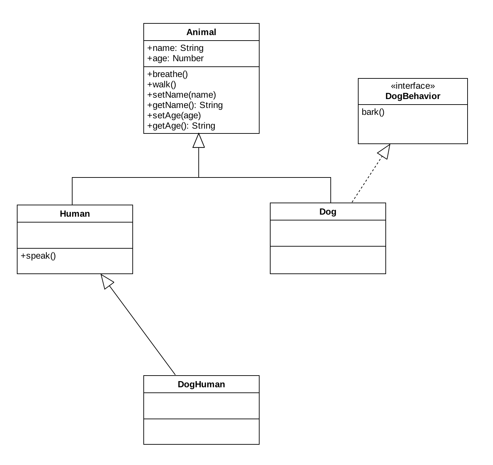
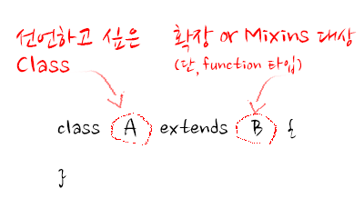

# ES2015, class의 시작
안녕하세요. 강승철입니다. 이번에 소개해드릴 내용은 ES2015 spec에 드디어 추가된 `class`입니다. 이걸 처음부터 설명을 안드린 이유는 이전 `function`을 이용한 `class` 설계와 크게 다르지 않다고 생각했었기 때문인데... 그렇지 않으신 모양입니다. (리엑트 스터디에 참석한 친구 이야기에 의하면...)

그래서, ES2015에서의 `class`에 대한 설명을 하면서 본격적인 객체지향 분석/설계시 필요한 약간의 기초지식도 함께 소개해드리도록 하겠습니다.
<br>
## class... 그림으로 그리기
제가 OOP를 좋아하는 이유는 코드나 말이 아닌, 그림으로 제가 구현하고자 하는 것을 표현할 수 있기 때문입니다. 그림은 꼭 개발자가 아니어도 누구나 알 수 있어서 지식전달에 매우 탁월합니다. 

일단 `class`를 그림으로 표현해보겠습니다.


위 그림은 [UML](https://ko.wikipedia.org/wiki/통합_모델링_언어)중 [Class diagram](https://en.wikipedia.org/wiki/Class_diagram)이라 합니다. class diagram은 클래스(class), 속성(attributes), 클래스간 함수(methods)를 이용하여 시스템의 구조를 기재하는 정적인 구조도입니다. 

하지만, 위 그림으로는 그 어떠한 정보도 얻을 수 없는 상태입니다. 이제 이 그림을 이용하여 Animal class를 표현해보겠습니다.



위 그림처럼 선으로 구분된 3영역 중 가장 윗부분은 class의 이름을 기술하는 영역입니다. 

이제 **Animal이 가져야 하는 것**이 무엇이 있는지를 정의해봅시다. 음.. 저는 이름(name)과 age(나이)를 가져야 한다고 생각합니다. 



선으로 구분된 3영역 중 중간 영역은 class가 가져야 하는 `속성(attributes)`을 정의하는 영역입니다. 속성 이름을 쓰고 콜론(:)을 이용하여 타입을 정의해줍니다.

그 다음으로 **Animal이 할 수 있는 행위**는 무엇이 있는지를 정의해봅시다. 여러분들은 어떻게 생각하실지 모르겠지만, 저는 숨을 쉴 수 있고(breathe), 걸을 수 있다고(walk) 생각합니다. 더불어서 이름도 설정(setName)/획득(getName)할 수 있고, 나이도 설정(setAge)/획득(getAge)할 수 있다고 생각합니다.



마지막으로 3영역 중 가장 아랫부분은 class가 할 수 있는 `행위(methods)`를 정의하는 영역입니다. 메소드 명을 적은 후 괄호(())를 붙여줍니다. setName이나 setAge와 같이 괄호 안에 무언가가 적혀 있는데, 이를 **인자**(arguments 또는 parameter)라 부르며 실제 메소드가 동작할 때 입력 받아야 하는 내용입니다. 또 getName이나 getAge와 같이 괄호 뒤에 콜론(:)이 붙어 있는 경우도 있는데, 이는 메소드가 실행되면 반환해야 하는 값의 타입을 기술한 것입니다. 
<br/>

## 그린 그림을 코드로 옮기기(1)

이를 기초로 ES3(or 5) spec으로 코드를 작성하면 다음과 같이 됩니다.

```
/* ES3(or 5) Spec */

function Animal () {
	this.name = null;
	this.age = null;
	console.log("Animal이 생성됩니다.");
}
Animal.prototype.breathe = function () {
	console.log("숨을 쉽니다.");
}
Animal.prototype.walk = function () {
	console.log("걷습니다.");
}
Animal.prototype.setName = function (name) {
	this.name = name;
}
Animal.prototype.getName = function () {
	return this.name;
}
Animal.prototype.setAge = function (age) {
	this.age = age;
}
Animal.prototype.getAge = function () {
	return this.age;
}

```

똑같이 위 class diagram을 기준으로 ES2015 spec으로 코드를 작성하면 다음과 같이 됩니다.

```
/* ES2015 Spec */

class Animal {

	constructor () {
		this.name = null;
		this.age = null;
		console.log("Animal이 생성됩니다.");
	}
	
	breathe () {
		console.log("숨을 쉽니다.");
	}
	
	walk () {
		console.log("걷습니다.");
	}
	
	setName (name) {
		this.name = name;
	}
	
	getName () {
		return this.name;
	}
	
	setAge (age) {
		this.age = age;
	}
	
	getAge () {
		return this.age;
	}
	
}

```

ES2015에서는 언어차원에서 `class`를 지원하도록 변경 되어 타언어진영이 (예를 들면 Java진영) JS를 바라볼 때 느끼던 이질감은 다소 해소될 것으로 보입니다.

## is-a
여기에서 `인간`을 생각해봅시다. `인간`과 `동물`을 어떻게 연관지어 문장으로 표현하면 어떻게 될까요? 제 생각으로는 이렇게 될 것 같습니다.

"인간은 동물이다."

이런 관계를 `is-a` 관계라 부릅니다. 이 관계를 class diagram으로 도식화 하면 다음과 같이 됩니다.



삼각형 화살표가 존재 하는 쪽 class를 `super class`와 존재하지 않는 쪽 class를 `subclass`라 칭하며, 이를 `상속(inheritance, generalization)`이라 부릅니다. 위 도식의 의미는 "Human class는 Animal class를 상속했다."라고 할 수 있습니다.

그리고, Animal class를 상속한 Human class는 Animal class가 가지고 있는 모든 속성과 메소드를 물려받습니다. ("물려받는다"는 표현이 어색할 수도 있는데, Human class에 따로 코드를 넣지 않아도 Animal class 처럼 동작한다는 의미임.)

<br/>

## 그린 그림을 코드로 옮기기(2)
다시 위 class diagram에 기초한 코드를 ES3(or 5) spec으로 표현하면 다음과 같습니다.

```
/* ES3(or 5) Spec */

function Animal () {
	this.name = null;
	this.age = null;
	console.log("Animal이 생성됩니다.");
}
Animal.prototype.breathe = function () {
	console.log("숨을 쉽니다.");
}
Animal.prototype.walk = function () {
	console.log("걷습니다.");
}
Animal.prototype.setName = function (name) {
	this.name = name;
}
Animal.prototype.getName = function () {
	return this.name;
}
Animal.prototype.setAge = function (age) {
	this.age = age;
}
Animal.prototype.getAge = function () {
	return this.age;
}

function Human () {
}
Human.prototype = new Animal();	

```

마찬가지로 위 class diagram을 기준으로 ES2015 spec으로 코드를 작성하면 다음과 같이 됩니다.

```
/* ES2015 Spec */

class Animal {

	constructor () {
		this.name = null;
		this.age = null;
		console.log("Animal이 생성됩니다.");
	}
	
	breathe () {
		console.log("숨을 쉽니다.");
	}
	
	walk () {
		console.log("걷습니다.");
	}
	
	setName (name) {
		this.name = name;
	}
	
	getName () {
		return this.name;
	}
	
	setAge (age) {
		this.age = age;
	}
	
	getAge () {
		return this.age;
	}
	
}

class Human extends Animal {

}

```

ES2015 spec에서는 Java처럼 `extends`라는 키워드로 `상속`표현할 수 있게 되었습니다. 

## is-a (2)

여기에서 `인간`의 친구인 `개`를 생각해봅시다. 그리고, `개`와 `동물`을 어떻게 연관지어 문장으로 표현하면 어떻게 될까요? 제 생각으로는 이렇게 될 것 같습니다.

"개은 동물이다."

네... `인간`이랑 같습니다. 이를 class diagram으로 도식화 하면 다음과 같습니다.


## 그린 그림을 코드로 옮기기(3)
다시 위 class diagram에 기초한 코드를 ES3(or 5) spec으로 표현하면 다음과 같습니다.

```
/* ES3(or 5) Spec */

function Animal () {
	this.name = null;
	this.age = null;
	console.log("Animal이 생성됩니다.");
}
Animal.prototype.breathe = function () {
	console.log("숨을 쉽니다.");
}
Animal.prototype.walk = function () {
	console.log("걷습니다.");
}
Animal.prototype.setName = function (name) {
	this.name = name;
}
Animal.prototype.getName = function () {
	return this.name;
}
Animal.prototype.setAge = function (age) {
	this.age = age;
}
Animal.prototype.getAge = function () {
	return this.age;
}

function Human () {
}
Human.prototype = new Animal();	

function Dog () {
}
Dog.prototype = new Animal();

```

마찬가지로 위 class diagram을 기준으로 ES2015 spec으로 코드를 작성하면 다음과 같이 됩니다.

```
/* ES2015 Spec */

class Animal {

	constructor () {
		this.name = null;
		this.age = null;
		console.log("Animal이 생성됩니다.");
	}
	
	breathe () {
		console.log("숨을 쉽니다.");
	}
	
	walk () {
		console.log("걷습니다.");
	}
	
	setName (name) {
		this.name = name;
	}
	
	getName () {
		return this.name;
	}
	
	setAge (age) {
		this.age = age;
	}
	
	getAge () {
		return this.age;
	}
	
}

class Human extends Animal {

}

class Dog extends Animal {

}

```

## 특수화(Specialization)
현재 상태로 보면 `인간`은 `동물`과 동일합니다. `인간`이란 일반적인 `동물`과 비교하여 **특별한 어떠한 행위를 할 수 있기 때문에 인간**이라 칭할 수 있습니다. 자, 어떤게 있을까요? 

저는 **"말을 할 수 있다(speak)"**라는 행위를 하기 때문에 인간이라 생각합니다. 이것을 class diagram으로 표현해보겠습니다.



같은 논리로... `개`는 일반적인 `동물`과 다르게 **어떠한 특별한 행위**를 할 수 있을까요? 

저는 **"짖는다(bark)"**라는 행위를 하기 떄문이라 생각합니다. 이것도 class diagram으로 표현해보겠습니다.



이와같이 `인간`과 `개`는 `동물`과 비교하면 무언가 특별합니다. 이를 가르켜 `특수화(Specialization)` 되었다고 합니다.

## 그린 그림을 코드로 옮기기(4)
다시 위 class diagram에 기초한 코드를 ES3(or 5) spec으로 표현하면 다음과 같습니다.

```
/* ES3(or 5) Spec */

function Animal () {
	this.name = null;
	this.age = null;
	console.log("Animal이 생성됩니다.");
}
Animal.prototype.breathe = function () {
	console.log("숨을 쉽니다.");
}
Animal.prototype.walk = function () {
	console.log("걷습니다.");
}
Animal.prototype.setName = function (name) {
	this.name = name;
}
Animal.prototype.getName = function () {
	return this.name;
}
Animal.prototype.setAge = function (age) {
	this.age = age;
}
Animal.prototype.getAge = function () {
	return this.age;
}

function Human () {
}
Human.prototype = new Animal();	
Human.prototype.speak = function () {
	console.log("말을 합니다.");
}

function Dog () {
}
Dog.prototype = new Animal();
Dog.prototype.bark = function () {
	console.log("짖습니다.");
}

```

마찬가지로 위 class diagram을 기준으로 ES2015 spec으로 코드를 작성하면 다음과 같이 됩니다.

```
/* ES2015 Spec */

class Animal {

	constructor () {
		this.name = null;
		this.age = null;
		console.log("Animal이 생성됩니다.");
	}
	
	breathe () {
		console.log("숨을 쉽니다.");
	}
	
	walk () {
		console.log("걷습니다.");
	}
	
	setName (name) {
		this.name = name;
	}
	
	getName () {
		return this.name;
	}
	
	setAge (age) {
		this.age = age;
	}
	
	getAge () {
		return this.age;
	}
	
}

class Human extends Animal {
	speak () {
		console.log("말을 합니다.");
	}
}

class Dog extends Animal {
	bark () {
		console.log("짖습니다.");
	}
}

```

# 실체화(Realization)
여기에서 `개인간`(DogHuman)을 만들어보도록 하겠습니다. (아마 다들 자의던 타의던 이 `class`의 인스턴스가 되어 보신 경험은 한번씩 있으실 것이라 믿습니다. ^^a) class diagram으로 표현 하면 다음과 같이 됩니다.


완성했습니다. 정말 쉽죠? `개인간`은 `개`와 `인간`의 행위를 동시에 하므로 `인간`과 `개`를 동시에 상속 받는 것으로 끝납니다.　이를 **다중상속**이라 하는데, 다중상속은 약간의 트러블을 유발할 여지가 있습니다. 이러한 문제를 **"죽음의 다이아몬드"**라 부르는데 자세한 설명은 [wikipedia](https://en.wikipedia.org/wiki/Multiple_inheritance#The_diamond_problem)를 확인해 보시길 바랍니다. 그냥 문제가 생길 여지가 있으니 깔끔하게 다중상속을 하지않는 방법을 사용하겠습니다.

다시, 사고(思考)를 집중해서 `개인간`은 `인간`에 가까운지, `개`에 가까운지 판단을 해야합니다. 저는 일단 `인간`에 가깝다고 하겠습니다. 그럼 `개인간`은 `인간`을 **상속**해야합니다.



이제 `개인간`은 `인간`의 모든 행위를 합니다. 그리고 `개인간`은 `개`의 행위도 해야 하는데, 상속으로 처리를 못하기 때문에 `개`자체의 정의를 바꿔야 합니다. 일단 `개`의 행위만을 따로 빼냅니다. 그리고, 빼낸 행위를 다음과 같이 표현합니다. 



위 그림에서 `DogBehavior`라는 이름으로 된 사각형을 **인터페이스(interface)**라 부릅니다. 인터페이스(interface)는 속성(attribute)을 가지지 않고 **오직 행위(method)**만을 가지며, 구현코드를 가지지않고 정의만 합니다.(java같은 언어는 말이죠...) 그래서 `개(Dog) class`가 bark를 구현하게 되고, 이를 가르켜 **"인터페이스 DogBehavior를 Dog class가 실체화 하였다."**라고 합니다.

같은 사고(思考)로 `개인간` 또한 인터페이스를 실체화 시켜주면 됩니다. 도식으로 표현하면 다들 예상하시는 것처럼 다음과 같이 됩니다.


## 그린 그림을 코드로 옮기기(5)
위에서 설명하기론 인터페이스는 오직 행위만을 가지며, 구현코드 가지지않고 정의만 한다고 하였습니다만, JS는 Swift의 protocol extionsions와 같이 **인터페이스가 구현코드를 가지게 됩니다**.

ES3(or 5)에서 위 class diagram 지난번에 소개한 Object.extend를 활용하겠습니다. Object.extend는 2개의 object를 인자로 받으며 첫번째 인자에 두번째 인자의 프로퍼티를 복사해주는 기능을 합니다.

```
/* ES3(or 5) Spec */

Object.extend = Object.extend || function (obj1, obj2) {
	for (var key in obj2) {
		obj1[key] = obj2[key];
	}
	return obj1;
};

function Animal () {
	this.name = null;
	this.age = null;
	console.log("Animal이 생성됩니다.");
}
Animal.prototype.breathe = function () {
	console.log("숨을 쉽니다.");
}
Animal.prototype.walk = function () {
	console.log("걷습니다.");
}
Animal.prototype.setName = function (name) {
	this.name = name;
}
Animal.prototype.getName = function () {
	return this.name;
}
Animal.prototype.setAge = function (age) {
	this.age = age;
}
Animal.prototype.getAge = function () {
	return this.age;
}

function Human () {
}
Human.prototype = new Animal();	
Human.prototype.speak = function () {
	console.log("말을 합니다.");
}

// 인터페이스...
var DogBehavior = {
	bark: function () {
		console.log("짖습니다.");
	}
};

function Dog () {
}
Dog.prototype = new Animal();
Dog.prototype = Object.extend(Dog.prototype, DogBehavior); // 인터페이스 실체화

function DogHuman () {
}
DogHuman.prototype = new Human();
DogHuman.prototype = Object.extend(DogHuman.prototype, DogBehavior); // 인터페이스 실체화

/* test */
var dogHuman1 = new DogHuman();
dogHuman1.speak();	// 출력 - 말을 합니다.
dogHuman1.bark();	// 출력 - 짖습니다.

```
이러한 식으로 `class`를 확장하는 방법을 JS에서는 **mixins**이라 합니다.

ES2015에서는 이러한 mixins이 꽤 제약이 많지만 구현하는 방법이 존재합니다. ([여기](https://developer.mozilla.org/en-US/docs/Web/JavaScript/Reference/Classes)에 잘 소개되어 있슴.)

```
/* ES2015 Spec */

class Animal {

	constructor () {
		this.name = null;
		this.age = null;
		console.log("Animal이 생성됩니다.");
	}

	breathe () {
		console.log("숨을 쉽니다.");
	}

	walk () {
		console.log("걷습니다.");
	}

	setName (name) {
		this.name = name;
	}

	getName () {
		return this.name;
	}

	setAge (age) {
		this.age = age;
	}

	getAge () {
		return this.age;
	}

}

class Human extends Animal {
	speak () {
		console.log("말을 합니다.");
	}
}

var DogBehaviorMixin = function (Base) {
	return class DogBehavior extends Base {
		bark () {
			console.log("짖습니다.");
		}
	}
};

class Dog extends DogBehaviorMixin(Animal) {
}

class DogHuman extends DogBehaviorMixin(Human) {

}

/* test */
let dogHuman1 = new DogHuman();
dogHuman1.speak();	// 출력 - 말을 합니다.
dogHuman1.bark();	// 출력 - 짖습니다.
		
		
```

...이건 다른 언어 경험자들이 봤을 때 굉장히 엽기적인 코드입니다. `extends` 대상을 어떠한 function의 return으로 받는 이런 형태는 Java Base의 개발자들에게 굉장한 스트레스를 안겨주기에 충분합니다. 

## 약간의 테스트...
재미있게도 실제 DogBehaviorMixin을 다음과 같이 바꾸어도 정상 동작합니다.

```
/* ES2015 Spec */

var DogBehaviorMixin = function (Base) {

	Base.prototype = Object.extend(Base.prototype, {
		bark: function () {
			console.log("짖습니다.");
		}
	});

	return Base;
};

```

즉, ES2015 Spec에서의 `extends` 키워드는 prototype을 확장해주는 **mixins**처럼 작동되고 있음을 알 수 있습니다.(아, 잘 모르시겠다구요? 그럼 그냥 느껴주세요. 이 이상 쉽게 설명을 못하겠....) 
더불어 하나 더 알 수 있는 것은 `extends` 뒤에 붙는 다른 `class`가 `prototype`이 존재하는 `function`이면 된다는 것입니다.

다음 코드를 봐주세요.

```
/* ES2015 Spec with ES5 */

function TT () {
}
TT.prototype.huk = function () {
	console.log("TT huk!!!");
};

class FF extends TT {
	huk () {
		console.log("FF huk!!!");
		super.huk();
	}
}

let ff = new FF();
ff.huk();
		
```
일반 `function`을 `extends` 키워드를 사용하여 상속했는데 이게 동작할까요? 

네... 이거 동작합니다. 이게 chrome에서만 동작하는 것인지는 더 확인 해봐야겠지만, 여기까지 해본 결과 얻을 수 있는 결론은 (ES2015를 집중적으로 하고 계시는 다른 JS개발자들이 늘 이야기하는...) 

**"`class`,`extends`는 그냥 ES5때 사용하던 사용하던 mixins의 문법 설탕(syntatic sugar)이다."**

입니다.

자, 그럼 더 이상 `class`와 `extends` 구문을 겁낼 이유가 없으며, 다음과 같이 이해하면 편할 것 같습니다.
 


여기서 잠깐! Java의 인터페이스 구현 코드를 보고 가겠습니다.

```
/* 갑자기 Java!!! */
class DogHuman extends Human implements DogBehavior {

	...

}
```
네, 꽤 깁니다. 하지만 어떤 클래스를 base로 하는지 확실하게 알 수 있고 어떤 부분이 인터페이스인지 확실하게 알 수 있습니다. 다시 저희가 짠 코드를 확인해보렊습니다.

```
/* ES2015 Spec */
class DogHuman extends DogBehaviorMixin(Human) {

	...
	
}

```

미려하지 않습니다. 어느것이 base class인지 알기가 어렵습니다. 

## 문법설탕(1)

현재 저희 짠 코드는 나타나지 않지만, mixins 대상이 2개 이상 되면 다음과 같이 지저분해집니다. 일단 코드를 보시겠습니다.

```
class Foo { }
class Bar extends CMinxin(BMixin(AMixin(Foo))) { }
```

위 코드는 Foo를 base class로 하고 AMixin, BMixin, CMinxin을 인터페이스로 하는 코드 입니다. 굉장히 지저분해짐을 알 수 있습니다.

이에 대한 제안으로 [Justin Fagnani](http://justinfagnani.com/author/justinfagnani/)의 블로그 내용을 소개해 드리겠습니다. 블로그 내용상으로 볼땐 Dart 언어의 `with` 키워드 처럼 mixins가 동작되도록 하는건데, 적용하면 문법이 이렇게 바뀝니다..


```
/* ES2015 Spec */
class Foo { }
class Bar extends mix(Foo).with(AMixin, BMixin, CMinxin) {

	...
	
}

```

와우! 가독성이 엄청 좋아졌습니다. base class를 Foo으로 하고 AMixin, BMixin, CMinxin을 인터페이스로 한 형태라고 그냥 알 수 있는 문법입니다. 게다가 미려하기까지합니다. 저는 이런 식의 아름다운 문법 만들어낼 수 있는게 바로 JS의 참 맛이라 생각합니다.

이 아름다운 문법을 만들기 위해서는 다음과 같은 코드가 필요합니다.

```
/* ES2015 spec */

class MixinBuilder {  

  constructor(superclass) {
    this.superclass = superclass;
  }

  with(...mixins) { 
    return mixins.reduce((c, mixin) => mixin(c), this.superclass);
  }
}

let mix = (superclass) => new MixinBuilder(superclass);

```

다소 생소해 보이는 위 코드를 ES3(or 5) Spec으로 바꾸면 다음과 같이 됩니다.

```
/* ES3(or 5) spec */
Object.extend = Object.extend || function (obj1, obj2) {
	for (var key in obj2) {
		obj1[key] = obj2[key];
	}
	return obj1;
};

function MixinBuilder (superclass) {
	this.superclass = superclass
}
MixinBuilder.prototype.with = function () {

	var mixins = Array.prototype.slice.call(arguments),
		inst = typeof this.superclass === "function"
				? new this.superclass()
				: {};

	for (i = 0, len = mixins.length; i < len; i++) {
		inst = Object.extend(inst, mixins[i]);
	}

	return inst;

}

function mix (superclass) {
	return new MixinBuilder(superclass);
}

```

ES2015 Spec에 비해서 많이 지저분 합니다만, 어쩔 수 없습니다. 이것을 지금까지의 코드에 적용하면 다음과 같이 됩니다.


```
/* ES3(or 5) spec */

Object.extend = Object.extend || function (obj1, obj2) {
	for (var key in obj2) {
		obj1[key] = obj2[key];
	}
	return obj1;
};

function MixinBuilder (superclass) {
	this.superclass = superclass
}
MixinBuilder.prototype.with = function () {

	var mixins = Array.prototype.slice.call(arguments),
		inst = typeof this.superclass === "function"
				? new this.superclass()
				: {};

	for (i = 0, len = mixins.length; i < len; i++) {
		inst = Object.extend(inst, mixins[i]);
	}

	return inst;

}

function mix (superclass) {
	return new MixinBuilder(superclass);
}

function Animal () {
	this.name = null;
	this.age = null;
	console.log("Animal이 생성됩니다.");
}
Animal.prototype = mix().with({
	breathe: function () {
		console.log("숨을 쉽니다.");
	},
	walk: function () {
		console.log("걷습니다.");
	},
	setName: function (name) {
		this.name = name;
	},
	getName: function () {
		return this.name;
	},
	setAge: function (age) {
		this.age = age;
	},
	getAge: function () {
		return this.age;
	}
});

function Human () {}
Human.prototype = mix(Animal).with({
	speak: function () {
		console.log("말을 합니다.");
	}
});

// 인터페이스...
var DogBehavior = {
	bark: function () {
		console.log("짖습니다.");
	}
};

function Dog () {}
Dog.prototype = mix(Animal).with(DogBehavior);

function DogHuman () {}
DogHuman.prototype = mix(Human).with(DogBehavior);

/* test */
var dogHuman1 = new DogHuman();
dogHuman1.speak();	// 출력 - 말을 합니다.
dogHuman1.bark();	// 출력 - 짖습니다.

```

오~ 미려해졌습니다. 이제 JS다워진 것 같습니다. 전 아직 내공이 약해서 이런 문법을 못만들어내는데... 정말 열심히 공부해야 할 것 같습니다. 

이제 다시 문제의 ES2015 spec의 그 코드로 돌아와서보면 굉장히 생소한데, 그 이유는 아마 `arrow function` 때문일 것입니다.

## Arrow Function?
`arrow function`은 ES2015 spec부터 사용할 수 있는 **익명함수**입니다. 그렇기 때문에 꼭 arrow function을 사용하지 않아도 되는데, 다음과 같은 잇점이 있기 때문에 익혀두시는게 좋습니다.

	1. 경량화된 function이다.
	2. 간결하다.

그간 사용하던 function은 (`function` 키워드를 사용한) prototype 확장을 하던 하지 않던 prototype을 가지고 있었습니다. 즉, 그만큼 메모리를 더 썻다는 것입니다. 뿐만아니라, `this` 키워드 콘텍스트 객체(context object)를 가르키기 때문에 이를 뒤트는 코드(.bind(this))를 강제로 넣어줘야 하는 문제가 있었습니다. arrow function을 사용하게 되면 arrow function을 감싸고 있는 스코프(scope)내의 this가 arrow function 내부의 this가 되므로 뒤트는 코드를 넣지 않아도 됩니다. 

일단, ES3(or 5) spec의 예시 코드를 보시겠습니다.

```
/* ES3(or 5) spec */
function KK () {

}
KK.prototype.test = function () {
	var oo = {
		objTest: function () {
			console.log(this);
		}
	}
	oo.objTest();
	
	function funcTest () {
		console.log(this);
	}

	funcTest();
}

var kk = new KK();
kk.test();

```

위 코드의 출력값은 무엇일까요? 아시는 분은 아시겠지만, oo 객체와 Window 객체가 출력됩니다. 일반적으로 제가 만나본 개발자들은 KK class의 인스턴스인 kk객체가 나올 것이라고 생각했습니다. 저 또한 JS를 (지금도 잘 모르지만) 잘 모를 땐 kk가 나올 것이라고 생각했으니까요...

이것을 저희들이 원하는 형태로 사용하려면 다음과 같이 코드를 바꿔야 합니다.

```
/* ES3(or 5) spec */
function KK () {

}
KK.prototype.test = function () {
	var oo = {
		objTest: function () {
			console.log(this);
		}.bind(this)
	}
	oo.objTest();
	
	function funcTest () {
		console.log(this);
	}

	funcTest.bind(this)();
}

var kk = new KK();
kk.test();

```

이것을 arrow function으로 바꾸면 다음과 같이 됩니다.

```
/* ES2015 spec */
function KK () {

}
KK.prototype.test = function () {
	let oo = {
		objTest: () => console.log(this)
	}
	oo.objTest();

	let funcTest = () => console.log(this);
	funcTest();
}

var kk = new KK();
kk.test();

```

출력은 저희들이 기대한 대로 kk 객체가 두번 출력됩니다. 

자, 이제 일반 function을 arrow function으로 바꾸는 방법을 알아 보겠습니다.

```
function add (a, b) {
	return a + b;
}
add(100, 200);	// 출력 - 300

```

간단한 합 연산을 하는 function 입니다. 먼저 add를 변수로 바꿉니다.

```
let add = function (a, b) {
	return a + b;
}
add(100, 200);	// 출력 - 300
```

이제 `function` 을 삭제합니다. (여기까지 하면 일단 에러남!!!)

```
let add = (a, b) { 	// Error!!
	return a + b;
}

add(100, 200);	
```
"(a, b)"와 "{" 사이에 `=>` 키워드를 넣어줍니다.

```
let add = (a, b) => {
	return a + b;
}

add(100, 200);	
```

중괄호({}) 내용이 한줄이면 중괄호도 삭제 가능합니다. 만약 그 한줄에 `return`이 라면 `return`도 삭제 가능합니다.(삭제 해야함!! 안하면 에러남!!)

```
let add = (a, b) => a + b;

add(100, 200);	// 출력 - 300
```

어떤가요? ^^ 참 쉽죠? 음... 이게 뭐야라고 생각하시는 분들이 계실텐데, 이건 문법이니 묻고 따지지 마시고 그냥 느끼시는게 정신건강상 이롭습니다.

## 문법설탕(2)
다시 mixins 문법 설탕으로 돌아오겠습니다.

```
/* ES2015 spec */

class MixinBuilder {  

  constructor(superclass) {
    this.superclass = superclass;
  }

  with(...mixins) { 
    return mixins.reduce((c, mixin) => mixin(c), this.superclass);
  }
}

let mix = (superclass) => new MixinBuilder(superclass);

```

이걸 위에서 배운 방법을 arrow function을 역으로 일반 function으로 변경해보겠습니다.


```
/* ES2015 spec */

class MixinBuilder {  

  constructor(superclass) {
    this.superclass = superclass;
  }

  with(...mixins) { 
    return mixins.reduce(function (c, mixin) { return mixin(c); }, this.superclass);
  }
}

function mix (superclass) {
	return new MixinBuilder(superclass);
}

```

이렇게 됩니다. 이제 이해가 되시겠죠? 아직 안되시는 구문이 하나 있다고요? "...mixins" 이건 그냥 with function의 인자를 Array로 만들어주는 문법입니다. 

이제 이 문법 설탕을 이용해서 ES2015 spec의 코드도 고쳐보겠습니다.


```
/* ES2015 Spec */

class MixinBuilder {  

  constructor(superclass) {
    this.superclass = superclass;
  }

  with(...mixins) { 
    return mixins.reduce((c, mixin) => mixin(c), this.superclass);
  }
}

let mix = (superclass) => new MixinBuilder(superclass);


class Animal {

	constructor () {
		this.name = null;
		this.age = null;
		console.log("Animal이 생성됩니다.");
	}

	breathe () {
		console.log("숨을 쉽니다.");
	}

	walk () {
		console.log("걷습니다.");
	}

	setName (name) {
		this.name = name;
	}

	getName () {
		return this.name;
	}

	setAge (age) {
		this.age = age;
	}

	getAge () {
		return this.age;
	}

}

class Human extends Animal {
	speak () {
		console.log("말을 합니다.");
	}
}

var DogBehaviorMixin = function (Base) {
	return class DogBehavior extends Base {
		bark () {
			console.log("짖습니다.");
		}
	}
};

class Dog extends mix(Animal).with(DogBehaviorMixin) {
}

class DogHuman extends mix(Human).with(DogBehaviorMixin) {

}

/* test */
var dogHuman1 = new DogHuman();
dogHuman1.speak();	// 출력 - 말을 합니다.
dogHuman1.bark();	// 출력 - 짖습니다.
			
```

마지막으로 `DogBehaviorMixin`을 위에서 익힌 `arrow function`으로 바꿔보도록 하겠습니다.

`function` 키워드를 지우고 "(Base)"와 "{" 사이에 `=>` 키워드를 넣습니다. 

```
var DogBehaviorMixin = (Base) => {
	return class DogBehavior extends Base {
		bark () {
			console.log("짖습니다.");
		}
	}
};

```

그 다음으로 `중괄호({})`를 삭제하는데 중괄호 내용이 **`return`문 한줄**이기 때문에 `return`도 삭제합니다.

```
var DogBehaviorMixin = (Base) => class DogBehavior extends Base {
	bark () {
		console.log("짖습니다.");
	}
};
```

`DogBehavior`를 삭제하여 익명 class로 바꿉니다.

```
var DogBehaviorMixin = (Base) => class extends Base {
	bark () {
		console.log("짖습니다.");
	}
};
```

`DogBehaviorMixin`를 `DogBehavior`로 바꿉니다.

```
var DogBehavior = (Base) => class extends Base {
	bark () {
		console.log("짖습니다.");
	}
};
```

이것을 적용한 전체 코드는 다음과 같습니다.

```
/* ES2015 spec */

class MixinBuilder {

  constructor(superclass) {
    this.superclass = superclass;
  }

  with(...mixins) {
    return mixins.reduce((c, mixin) => mixin(c), this.superclass);
  }
}

let mix = (superclass) => new MixinBuilder(superclass);


class Animal {

	constructor () {
		this.name = null;
		this.age = null;
		console.log("Animal이 생성됩니다.");
	}

	breathe () {
		console.log("숨을 쉽니다.");
	}

	walk () {
		console.log("걷습니다.");
	}

	setName (name) {
		this.name = name;
	}

	getName () {
		return this.name;
	}

	setAge (age) {
		this.age = age;
	}

	getAge () {
		return this.age;
	}

}

class Human extends Animal {
	speak () {
		console.log("말을 합니다.");
	}
}

// 인터페이스
let DogBehavior = (Base) => class extends Base {
	bark () {
		console.log("짖습니다.");
	}
};

class Dog extends mix(Animal).with(DogBehavior) {
}

class DogHuman extends mix(Human).with(DogBehavior) {

}

let dogHuman1 = new DogHuman();
dogHuman1.speak();	// 출력 - 말을 합니다.
dogHuman1.bark();	// 출력 - 짖습니다.

```


